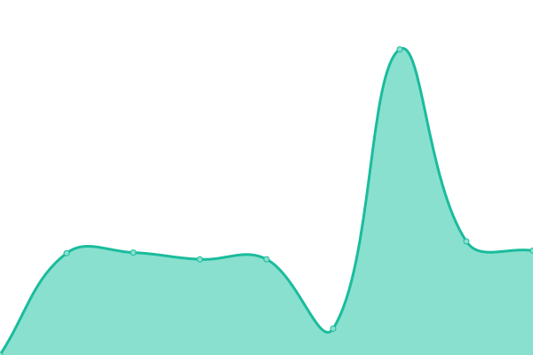

# [📈 Live Status](https://ArmadaSoftware.github.io/status): <!--live status--> **🟩 All systems operational**

This repository contains the open-source uptime monitor and status page for [Armada Yazılım](https://www.armadayazilim.com/), powered by [Upptime](https://github.com/upptime/upptime).

With [Upptime](https://upptime.js.org), you can get your own unlimited and free uptime monitor and status page, powered entirely by a GitHub repository. We use [Issues](https://github.com/ArmadaSoftware/status/issues) as incident reports, [Actions](https://github.com/ArmadaSoftware/status/actions) as uptime monitors, and [Pages](https://ArmadaSoftware.github.io/status) for the status page.

<!--start: status pages-->
<!-- This summary is generated by Upptime (https://github.com/upptime/upptime) -->
<!-- Do not edit this manually, your changes will be overwritten -->
<!-- prettier-ignore -->
| URL | Status | History | Response Time | Uptime |
| --- | ------ | ------- | ------------- | ------ |
|  [Armada Yazılım](https://armadayazilim.com/) | 🟩 Up | [armada-yazilim.yml](https://github.com/ArmadaSoftware/status/commits/HEAD/history/armada-yazilim.yml) | 

 2596ms
     
 | 

<a href="https://status.armadayazilim.com/history/armada-yazilim">78.56%</a>
    

|  [Armada Yazılım - 3dexperience](https://3dexperience.armadayazilim.com/) | 🟩 Up | [armada-yazilim-3dexperience.yml](https://github.com/ArmadaSoftware/status/commits/HEAD/history/armada-yazilim-3dexperience.yml) | 

 2349ms
     
 | 

<a href="https://status.armadayazilim.com/history/armada-yazilim-3dexperience">100.00%</a>
    

|  [Armada Yazılım - Blog](https://blog.armadayazilim.com/) | 🟩 Up | [armada-yazilim-blog.yml](https://github.com/ArmadaSoftware/status/commits/HEAD/history/armada-yazilim-blog.yml) | 

 1419ms
     
 | 

<a href="https://status.armadayazilim.com/history/armada-yazilim-blog">100.00%</a>
    

|  [Armada Yazılım - Arex](https://arex.armadayazilim.com/) | 🟩 Up | [armada-yazilim-arex.yml](https://github.com/ArmadaSoftware/status/commits/HEAD/history/armada-yazilim-arex.yml) | 

 1796ms
     
 | 

<a href="https://status.armadayazilim.com/history/armada-yazilim-arex">100.00%</a>
    

|  [Armada Yazılım - Proje](https://proje.armadayazilim.com/) | 🟩 Up | [armada-yazilim-proje.yml](https://github.com/ArmadaSoftware/status/commits/HEAD/history/armada-yazilim-proje.yml) | 

 5355ms
     
 | 

<a href="https://status.armadayazilim.com/history/armada-yazilim-proje">100.00%</a>
    

|  [Armada Yazılım - DelmiaWorks](https://delmiaworks.armadayazilim.com/) | 🟩 Up | [armada-yazilim-delmia-works.yml](https://github.com/ArmadaSoftware/status/commits/HEAD/history/armada-yazilim-delmia-works.yml) | 

 989ms
     
 | 

<a href="https://status.armadayazilim.com/history/armada-yazilim-delmia-works">100.00%</a>
    

|  [Armada Yazılım - ArmadaWorks](https://armadaworks.net/) | 🟩 Up | [armada-yazilim-armada-works.yml](https://github.com/ArmadaSoftware/status/commits/HEAD/history/armada-yazilim-armada-works.yml) | 

 923ms
     
 | 

<a href="https://status.armadayazilim.com/history/armada-yazilim-armada-works">100.00%</a>
    

|  [Maksimo](https://maksimo.com/) | 🟩 Up | [maksimo.yml](https://github.com/ArmadaSoftware/status/commits/HEAD/history/maksimo.yml) | 

 1223ms
     
 | 

<a href="https://status.armadayazilim.com/history/maksimo">100.00%</a>
    

<!--end: status pages-->

[**Visit our status website →**](https://ArmadaSoftware.github.io/status)

## 📄 License

- Powered by: [Upptime](https://github.com/upptime/upptime)
- Code: [MIT](./LICENSE) © [Armada Yazılım](https://www.armadayazilim.com/)
- Data in the `./history` directory: [Open Database License](https://opendatacommons.org/licenses/odbl/1-0/)
